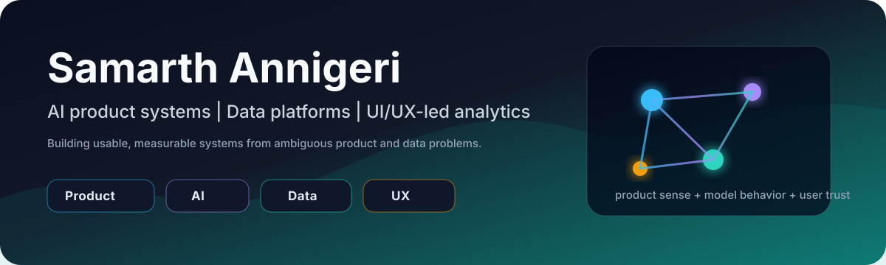
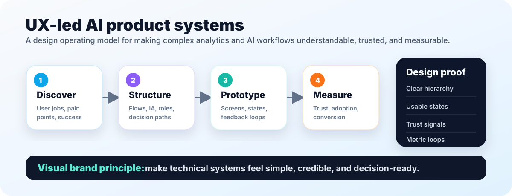

[LinkedIn](https://www.linkedin.com/in/samarth-annigeri-14326a178/) | [Product Portfolio](https://theindianmagenta.notion.site/Product-Portfolio-f56b69796af74829a005df99d3cadf4b) | [Email](mailto:samarth.annigeri@mail.mcgill.ca)

**AI product systems | Data platforms | UX-led analytics | Applied ML**

---

## Who I Am

I build AI and data products where technical depth, product judgment, and user experience need to work together. My work spans agent workflows, analytics pipelines, forecasting, causal inference, dashboards, and product-facing systems that help teams make better decisions.

My strongest lane is translating ambiguous business needs into systems people can actually use: clear workflows, measurable outputs, reliable data foundations, and interfaces that make complex information easier to act on.

## UI/UX + Product Lens

I bring a UI/UX background into technical product work, especially when the product depends on trust, clarity, and repeated use.

| UX Strength | How It Shows Up In My Work |
|---|---|
| Information architecture | Turning messy workflows, requirements, and datasets into clear product structures. |
| Interaction design | Designing flows, states, and feedback loops that reduce user uncertainty. |
| Dashboard design | Building decision surfaces with hierarchy, filtering, metrics, and business context. |
| Product storytelling | Explaining technical systems in a way recruiters, users, and stakeholders can scan quickly. |
| Measurement mindset | Connecting product changes to activation, conversion, trust, engagement, or operational efficiency. |

## Current Focus

- AI product engineering and LLM application workflows.
- Data architecture, analytics delivery, and workflow automation.
- Applied ML for forecasting, risk analytics, NLP, and causal inference.
- UX-led product systems that convert messy inputs into decision-ready artifacts.

## What To Review First

| Area | Repository | Why It Matters |
|---|---|---|
| AI product systems | [autonomous-pm-engine](https://github.com/Agent007repo/autonomous-pm-engine) | Multi-agent prototype for turning customer feedback into PRDs, roadmaps, and priority matrices. |
| Applied ML risk analytics | [SCRI Supply Chain Risk Intelligence](https://github.com/Agent007repo/SCRI-Supply-Chain-Risk-Intelligence-System) | Time-series and anomaly-detection project for global supply-chain stress signals. |
| Quantitative ML | [Advanced Stock Return Prediction](https://github.com/Agent007repo/Advanced-Stock-Return-Prediction-and-Portfolio-Optimization) | ML-driven return prediction and portfolio construction with out-of-sample evaluation. |
| Product analytics | [Causal Inference Project](https://github.com/Agent007repo/Causal_Inference_Project-) | Causal analysis of an email campaign's effect on conversion. |
| Applied ML workflow | [Air Quality Prediction](https://github.com/Agent007repo/Air_Quality_Random_Forest_Model_Project) | Supervised regression workflow with EDA, feature selection, and model evaluation. |
| NLP and network analytics | [Vaccination Tweet Analysis](https://github.com/Agent007repo/Vaccination-Tweet-Analysis) | Sentiment, network, and event-analysis notebook for public discourse analytics. |

## Selected Project Signals

| Project | Signal |
|---|---|
| Autonomous PM Engine | AI workflow design, retrieval, product artifacts, agent-style reasoning, FastAPI prototype. |
| SCRI | LSTM autoencoder, LightGBM, public macro/market signals, risk scoring, event backtesting. |
| Stock Return Prediction | Regularized models, neural-network comparison, portfolio construction, risk metrics. |
| Causal Inference | ATE estimation, meta-learners, DoWhy-style causal framing, refutation mindset. |
| Air Quality Prediction | End-to-end supervised ML workflow with EDA, feature selection, and regression metrics. |
| Vaccination Tweet Analysis | NLP, sentiment analysis, social network analytics, community detection, event analysis. |

## Technical Stack

| Layer | Tools and Methods |
|---|---|
| Languages and analysis | Python, SQL, Jupyter, pandas, NumPy, scikit-learn |
| ML and analytics | LightGBM, Random Forest, time series, causal inference, NLP, network analysis |
| AI systems | LLM APIs, retrieval workflows, agent-style orchestration, vector search, graph concepts |
| Product and delivery | FastAPI, dashboards, workflow design, UX flows, stakeholder-ready product artifacts |

## Role Fit

Best-fit roles are at the intersection of product judgment, analytics depth, technical implementation, and user-centered systems design:

- AI Product Manager
- Data Product Manager
- AI / ML Engineer for applied LLM or analytics products
- Data Platform / Analytics Specialist
- Product Analytics or Decision Science roles
- Technical Product Manager for data, AI, or workflow automation products

## Project Maturity Notes

Not every repository has the same maturity level. Some are production-style prototypes, some are course or notebook projects, and some are supporting evidence for specific skills. The strongest review path is to start with the flagship projects above rather than treating every repository as equal.

## Current Cleanup Priorities

- Keep pinned repositories focused on the strongest evidence.
- Add reproducible setup instructions and requirements files across notebooks.
- Add sample outputs and limitations sections for projects with strong claims.
- Keep Notion-only portfolio projects out of GitHub unless the repository itself contains enough evidence to review.
- Use the portfolio to show deeper UI/UX case studies, screens, product thinking, and visual design work.

## Contact

I am open to roles across AI product, applied ML, analytics engineering, data product delivery, and technical product management.